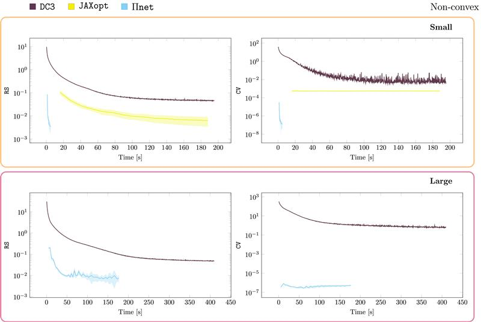

# &Pi;net: Optimizing hard-constrained neural networks with orthogonal projection layers

[](https://www.arxiv.org/abs/2508.10480)
[](https://github.com/antonioterpin/pinet/stargazers)
[](https://github.com/antonioterpin/pinet/LICENSE)
[](https://codecov.io/gh/antonioterpin/pinet)
[](https://github.com/antonioterpin/pinet/actions/workflows/test.yaml)
[](https://pypi.org/project/pinet-hcnn)

[](https://www.linkedin.com/in/panagiotis-grontas-4517b0184)
[](https://twitter.com/antonio_terpin)


This repository contains a [JAX](https://github.com/jax-ml/jax) implementation of &Pi;net, an output layer for neural networks that ensures the satisfaction of specified convex constraints.

> [!NOTE]
> **TL;DR:**
> &Pi;net leverages operator splitting for rapid and reliable projections in the forward pass, and the implicit function theorem for backpropagation. It offers a *feasible-by-design* optimization proxy for parametric constrained optimization problems to obtain modest-accuracy solutions faster than traditional solvers when solving a single problem, and significantly faster for a batch of problems.

## Getting started
To install &Pi;net, run:
- CPU-only (Linux/macOS/Windows)
  ```bash
  pip install pinet-hcnn
  ```
- GPU (NVIDIA, CUDA 12)
  ```bash
  pip install "pinet-hcnn[cuda12]"
  ```

> [!WARNING]
> **CUDA dependencies**: If you have issues with CUDA drivers, please follow the official instructions for [cuda12 and cudnn](https://developer.nvidia.com/cuda-downloads?target_os=Linux&target_arch=x86_64&Distribution=Ubuntu&target_version=22.04&target_type=deb_local) (Note: wheels only available on linux). If you have issues with conflicting CUDA libraries, check also [this issue](https://github.com/jax-ml/jax/issues/17497)... or use our Docker container 🤗.

We also provide a working [Docker](https://docs.docker.com/) image to reproduce the results of the paper and to build on top.
```bash
docker compose run --rm pinet-cpu # Run the pytests on CPU
docker compose run --rm pinet-gpu # Run the pytests on GPU
```
> [!WARNING]
> **CUDA dependencies**: Running the Docker container with GPU support requires [NVIDIA Container Toolkit](https://docs.nvidia.com/datacenter/cloud-native/container-toolkit/latest/install-guide.html) on the host.

See also the section on [reproducing the paper's results](#reproducing-the-papers-results) for more examples of commands.


### Supported platforms 💻
|        | Linux x86\_64 | Linux aarch64 | Mac aarch64 | Windows x86\_64 | Windows WSL2 x86\_64 |
| -------------- | ------------- | ------------- | ----------- | --------------- | -------------------- |
| **CPU**        | ✅           | ✅           | ✅         | ✅             | ✅                  |
| **NVIDIA GPU** | ✅           | ✅           | n/a         | ❌              | ❌         |


## Examples

# Constraints & Projection Layer
All tensors are **batched**. Let `B` = batch size (you may use `B=1` to broadcast across a batch).

- Vectors: shape `(B, n, 1)`
- Matrices: shape `(B, n, d)`

## EqualityConstraint — enforce `A @ x == b`

```python
import jax.numpy as jnp
from pinet import EqualityConstraint

B, n_eq, d = 4, 3, 5
A = jnp.zeros((1, n_eq, d))         # (1, n_eq, d)  # broadcast across batch
b = jnp.zeros((B, n_eq, 1))         # (B, n_eq, 1)

eq = EqualityConstraint(
    A=A,
    b=b,
    method=None,                    # let Project decide / lift later
    var_b=True,                     # b provided per-batch at runtime
    var_A=False,                    # A constant (broadcasted)
)
```

> [!WARNING]
> **`method=None`**: `eq.project()` is only available if `method="pinv"`.
> When you have multiple constraints and you plan on using the equality constraint only within the projection layer, you can leave `method=None` (as above).

## AffineInequalityConstraint — enforce `lb ≤ C @ x ≤ ub`

```python
import jax.numpy as jnp
from pinet import AffineInequalityConstraint

n_ineq = 7
C  = jnp.zeros((1, n_ineq, d))      # (1, n_ineq, d)
lb = jnp.full((B, n_ineq, 1), -1.0) # (B, n_ineq, 1)
ub = jnp.full((B, n_ineq, 1),  1.0) # (B, n_ineq, 1)

ineq = AffineInequalityConstraint(C=C, lb=lb, ub=ub)
```

> [!WARNING]
> **`ineq.project()` intentionally `NotImplemented`**: To improve the efficiency of the projection, we always "lift" the affine inequality constraints as described in the paper. For this, we did not even bother implementing the projection method for this type of constraints 🤗.

## BoxConstraint — clip selected dimensions

```python
import numpy as np
import jax.numpy as jnp
from pinet import BoxConstraint, BoxConstraintSpecification

lb_x = jnp.full((B, d, 1), -2.0)    # (B, d, 1)
ub_x = jnp.full((B, d, 1),  2.0)    # (B, d, 1)
mask = np.ones(d, dtype=bool)       # apply to all dims (use False to skip dims)

box = BoxConstraint(BoxConstraintSpecification(lb=lb_x, ub=ub_x, mask=mask))
# box.project(...) clips x[:, mask, :] into [lb_x, ub_x].
```

## Combine constraints with `Project` (Douglas–Rachford)

`Project` handles:
- **Lifting** inequalities into equalities + auxiliary variables;
- Optional **Ruiz equilibration**;
- JIT-compiled forward;
- Optional custom VJP for backprop.

```python
from pinet.project import Project
from pinet.dataclasses import ProjectionInstance
import jax.numpy as jnp

proj = Project(
    eq_constraint=eq,              # can be None
    ineq_constraint=ineq,          # can be None
    box_constraint=box,            # can be None
    unroll=False,                  # use custom VJP path by default
)

# Build a ProjectionInstance with the point to project and (optionally) runtime specs:
x0 = jnp.zeros((B, d, 1))
yraw = ProjectionInstance(x=x0)
# If var_b=True and you supply per-batch b at runtime, pass it via your dataclass, e.g.:
# yraw = yraw.update(eq=yraw.eq.update(b=b))

y, sK = proj.call(       # JIT-compiled projector
    yraw=yraw,
    n_iter=50,                    # Douglas-Rachford iterations
    n_iter_backward=100,          # Maximum number of iterations for the bicgstab algorithm
    sigma=1.0, omega=1.7,
)

# If you want to resume the projection with the latest governing sequence sK,
# you can provided to the call method via s0=sK.

cv = proj.cv(y)  # (B, 1, 1) max violation across constraints
                 # The CV can also be assessed for the different constraints separately,
                 # e.g., eq.cv(y), if eq is a constraint for y
                 # (shapes need to match, so be careful of lifting!)
```

### Notes
- **Batch rules:** For each pair of tensors `(X, Y)`, either batch sizes match or one is `1` (broadcast).
- **Equality `method`:** Use `method="pinv"` when you rely on the equality projector standalone. When used inside `Project`, you can keep `method=None`; lifting will set up the pseudo-inverse internally.
- **Dimensions after lifting:** If inequalities are present, the internal lifted dimension is `d + n_ineq` (auxiliary variables).

---

# Minimal “Toy MPC” Application

The helper below wires the projector into a Pinet model; the loss is your batched objective.

```python
# benchmarks/toy_MPC/model.py
import jax.numpy as jnp
from flax import linen as nn
from pinet import BoxConstraint, BoxConstraintSpecification, EqualityConstraint
from src.benchmarks.model import build_model_and_train_step, setup_pinet

def setup_model(rng_key, hyperparameters, A, X, b, lb, ub, batched_objective):
    activation = getattr(nn, hyperparameters["activation"])
    if activation is None:
        raise ValueError(f"Unknown activation: {hyperparameters['activation']}")

    # Constraints (b varies at runtime; A is constant & broadcasted)
    eq  = EqualityConstraint(A=A, b=b, method=None, var_b=True)
    box = BoxConstraint(BoxConstraintSpecification(lb=lb, ub=ub))
    project, project_test, _ = setup_pinet(eq_constraint=eq, box_constraint=box,
                                           hyperparameters=hyperparameters)

    model, params, train_step = build_model_and_train_step(
        rng_key=rng_key,
        dim=A.shape[2],
        features_list=hyperparameters["features_list"],
        activation=activation,
        project=project,                # projector in the training graph
        project_test=project_test,      # projector used at eval
        raw_train=hyperparameters.get("raw_train", False),
        raw_test=hyperparameters.get("raw_test", False),
        loss_fn=lambda preds, _b: batched_objective(preds),
        example_x=X[:1, :, 0],
        example_b=b[:1],
        jit=True,
    )
    return model, params, train_step
```

### Run the end-to-end script
To reproduce the results in the paper, you can run
```bash
python -m src.benchmarks.toy_MPC.run_toy_MPC --filename toy_MPC_seed42_examples10000.npz --config toy_MPC --seed 0
```
To generate the dataset, run
```bash
python -m src.benchmarks.toy_MPC.generate_toy_MPC
```

You’ll get:
- **Training logs** (loss, CV, timing),
- **Validation/Test** metrics incl. relative suboptimality & CV,
- **Saved params & results** ready to reload and plot trajectories.

> [!TIP]
> **Troubleshooting**: All the objects in `pinet.dataclasses` offer a `validate` methods, which can be used to verify your inputs.

### Works using &Pi;net ⚙️
We collect here applications using &Pi;net. Please feel free to open a pull request to add yours! 🤗

Link | Project
--|--
[](https://github.com/antonioterpin/glitch) | **Multi-vehicle trajectory optimization with non-convex preferences**<br/>This project features contexts dimensions in the millions and tens of thousands of optimization variables.

## Contributing ☕️
Contributions are more than welcome! 🙏 Please check out our [contributing page](./CONTRIBUTING.md), and feel free to open an issue for problems and feature requests⚠️.

## Benchmarks 📈
Below, we summarize the performance gains of &Pi;net over state-of-the-art methods. We consider the following metrics:
- Relative Suboptimality ($\texttt{RS}$): The suboptimality of a candidate solution $\hat{y}$ compared to the optimal objective $J(y^{\star})$, computed by a high-accuracy solver.
- Constraint Violation ($\texttt{CV}$): Maximum violation ($\infty$-norm) of any constraint (equality and inequality). In practice, any solver achieving a $\texttt{CV}$ below $10^{-5}$ is considered to have high accuracy and there is little benefit to go below that. Instead, when methods have sufficiently low $\texttt{CV}$, having a low $\texttt{RS}$ is better.
- Learning curves: Progress on $\texttt{RS}$ and $\texttt{CV}$ over wall-clock time on the validation set.
- Single inference time: The time required to solve one instance at test time.
- Batch inference time: The time required to solve a batch of $1024$ instances at test time.

We report the results for an optimization problem with optimization variable of dimension $d$, $n_{\mathrm{eq}}$ equality and $n_{\mathrm{ineq}}$ inequality convex constraints and with a  non-convex objective. Here, we use a small and a large (in the parametric optimization sense) datasets $(d, n_{\mathrm{eq}}, n_{\mathrm{ineq}})  \in \{(100, 50, 50), (1000, 500, 500)\}$.




Overall, &Pi;net outperforms the state-of-the-art in accuracy and training times.
For more comparisons and ablations, please check out our [paper](https://arxiv.org/abs/2508.10480).

### Reproducing the paper's results
To reproduce the paper's results from &Pi;net, JAXopt and cvxpylayers run the bash script:
```bash
sh src/benchmarks/QP/run_QP_batch.sh
```

To run individual experiments use:
```bash
python -m src.benchmarks.QP.run_QP --seed 0 --id <ID> --config <CONFIG>  --proj_method <METHOD>
```
To select `ID`, `CONFIG`, and `METHOD`, please refer to the bash script above.

> [!WARNING]
> **Large dataset**: The repo contains only the data to run the small benchmark. For the large one, you can refer to the supplementary material on OpenReview.
In a future release, we plan to provide several datasets with [Hugging face 🤗](https://huggingface.co/) or similar providers, and this step will be less tedious.

For `DC3`, we used the [open-source implementation](https://github.com/locuslab/DC3).

> [!TIP]
> **With Docker 🐳**: To run the above commands within th docker container, you can use
> ```bash
> docker compose run --rm pinet-cpu -m src.benchmarks.QP.run_QP --seed 0 --id <ID> --config <CONFIG>  --proj_method <METHOD> # run on CPU
> docker compose run --rm pinet-gpu -m src.benchmarks.QP.run_QP --seed 0 --id <ID> --config <CONFIG>  --proj_method <METHOD> # run on GPU
> ```

For the toy MPC, please refer to [the examples section](#a-toy-example-approximating-a-mpc-controller). For the second-order cone constraints, you can use [this notebook](./src/benchmarks/toy_SOC/main.py).

## Citation 🙏
If you use this code in your research, please cite our paper:
```bash
   @inproceedings{grontas2025pinet,
     title={Pinet: Optimizing hard-constrained neural networks with orthogonal projection layers},
     author={Grontas, Panagiotis D. and Terpin, Antonio and Balta C., Efe and D'Andrea, Raffaello and Lygeros, John},
     journal={arXiv preprint arXiv:2508.10480},
     year={2025}
   }
```
